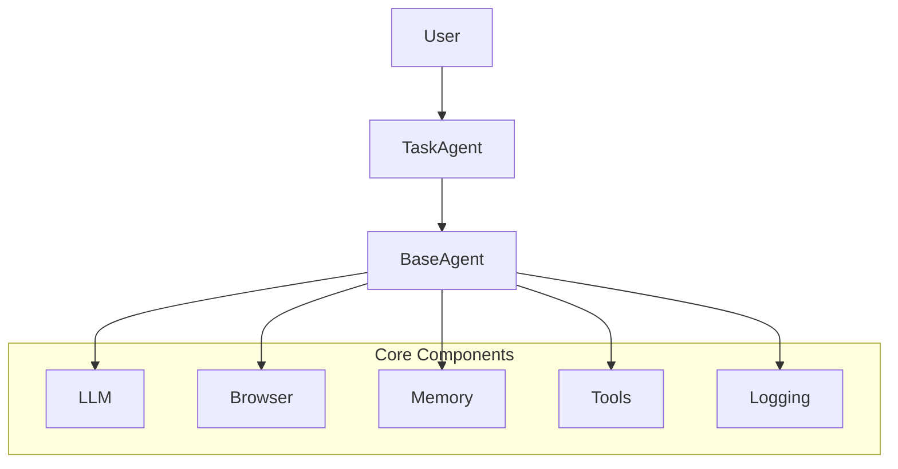
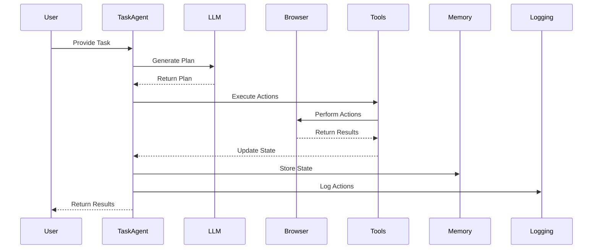
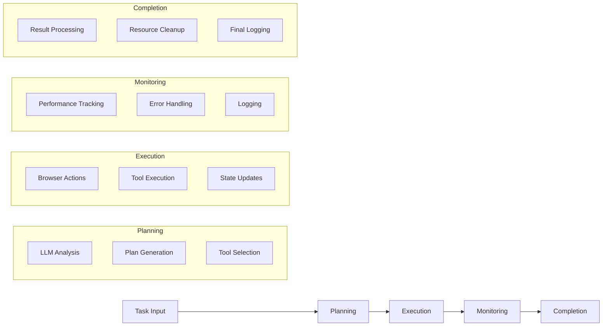

# Nova Architecture

## Overview

Nova is a browser automation agent that uses LLMs to understand and execute tasks. The system is built with a modular architecture that allows for easy extension and customization.

## System Architecture

## Component Interaction

## Data Flow

## Core Components

### 1. Base Agent

The `BaseAgent` class provides the foundation for all agent types. It handles:
- State management
- Browser interaction
- Tool execution
- Error handling
- Performance monitoring

### 2. Task Agent

The `TaskAgent` class extends `BaseAgent` to provide task-specific functionality:
- Task planning and execution
- Browser automation
- Tool integration
- Memory management
- Logging and monitoring

### 3. LLM Integration

The `LLM` class provides a unified interface for different LLM providers:
- OpenAI
- Anthropic
- Custom providers
- Configuration management
- Response handling

### 4. Browser Control

The `Browser` class manages browser automation:
- Page navigation
- Element interaction
- Screenshot capture
- DOM manipulation
- Error recovery

### 5. Tool System

The tool system allows for extensible action execution:
- Browser tools (navigation, clicking, typing)
- Custom tools
- Tool registration
- Tool execution
- Result handling

### 6. Memory System

The `Memory` class provides state persistence:
- Action history
- Context management
- State tracking
- Error recovery
- Performance metrics

### 7. Logging System

The logging system tracks agent interactions:
- Action logging
- Error tracking
- Performance metrics
- Debug information
- Session management

## Data Flow

1. **Task Initialization**:
   - User provides task description
   - Agent initializes components
   - Memory system loads context

2. **Planning Phase**:
   - LLM generates execution plan
   - Plan is validated and structured
   - Tools are selected for execution

3. **Execution Phase**:
   - Browser performs actions
   - Tools execute commands
   - Results are captured
   - State is updated

4. **Monitoring Phase**:
   - Performance is tracked
   - Errors are handled
   - Logs are generated
   - Memory is updated

5. **Completion Phase**:
   - Results are returned
   - Resources are cleaned up
   - Logs are finalized
   - Memory is persisted

## Error Handling

The system implements comprehensive error handling:
- Browser errors
- Tool execution errors
- LLM errors
- Memory errors
- Recovery strategies

## Performance Monitoring

Performance is tracked at multiple levels:
- LLM latency
- Browser action timing
- Tool execution time
- Memory operations
- Overall task duration

## Configuration

The system is highly configurable:
- LLM settings
- Browser options
- Tool configurations
- Memory settings
- Logging preferences

## Extensibility

The architecture supports easy extension:
- New agent types
- Custom tools
- Additional LLM providers
- Alternative memory systems
- Custom logging implementations 